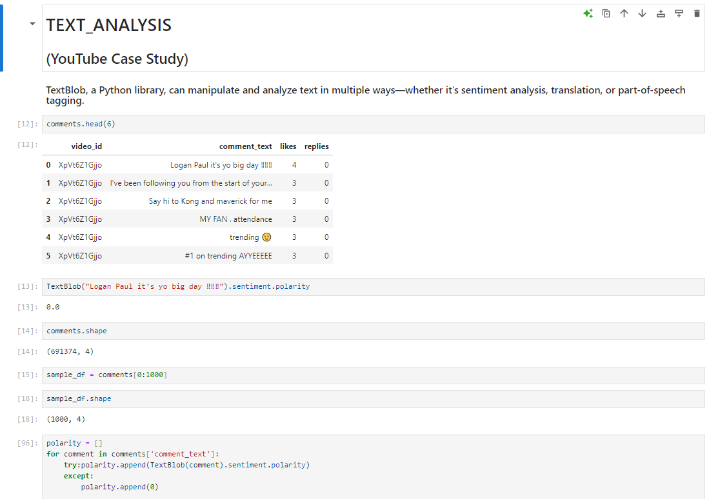
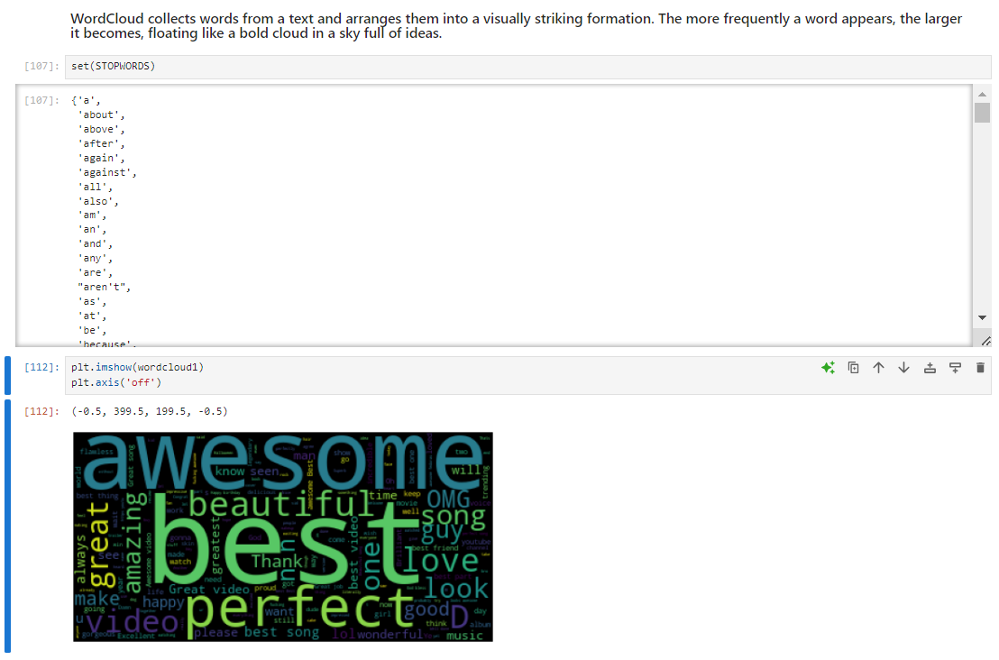
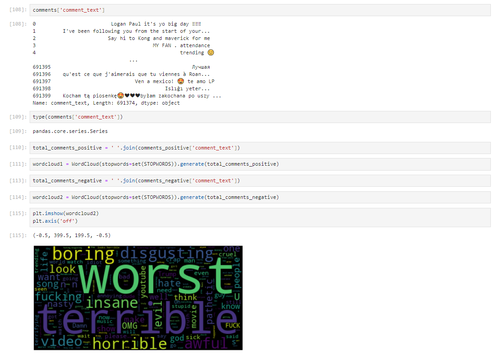
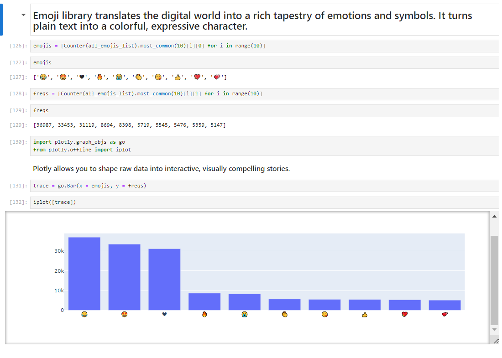
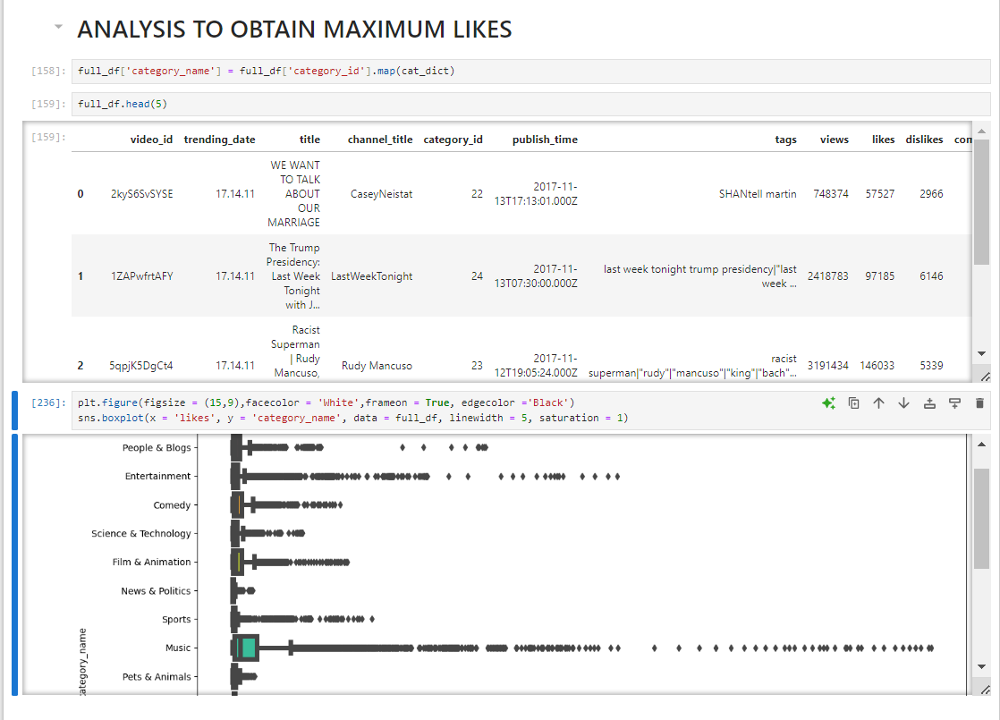
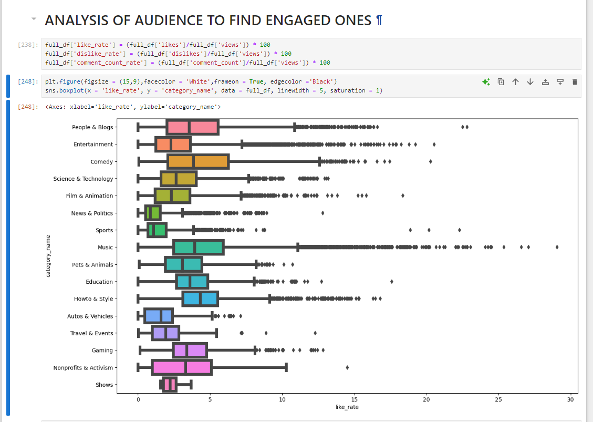
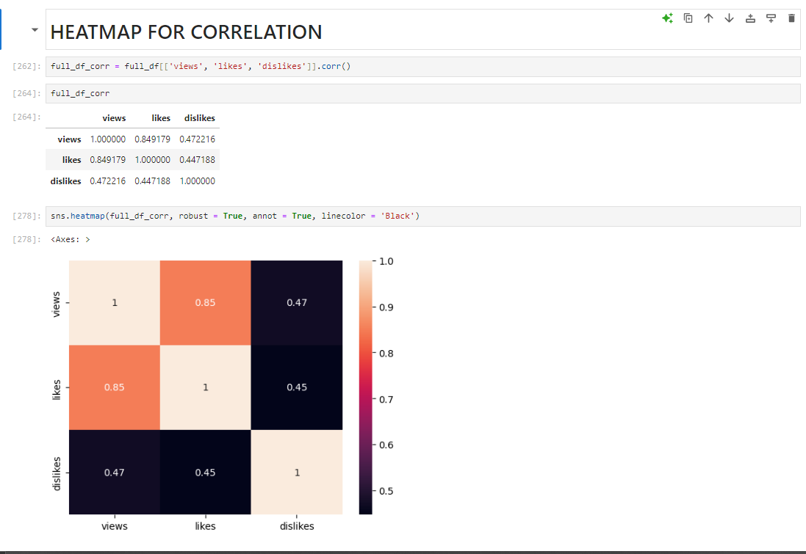
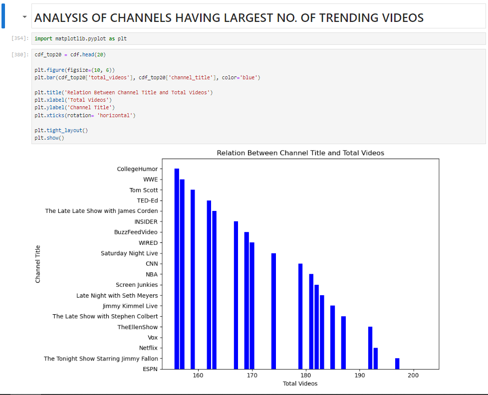

#  Text Analysis
## Description
Conducted sentiment analysis and data visualization on YouTube comments using the TextBlob library,
uncovering insights on audience engagement,
emoji usage, and video performance metrics.
Implemented linear regression models to explore correlations between views, likes, video titles, and audience engagement.

## Screenshots
 

     
     

     
     

     
     

 

## Tech Stack

